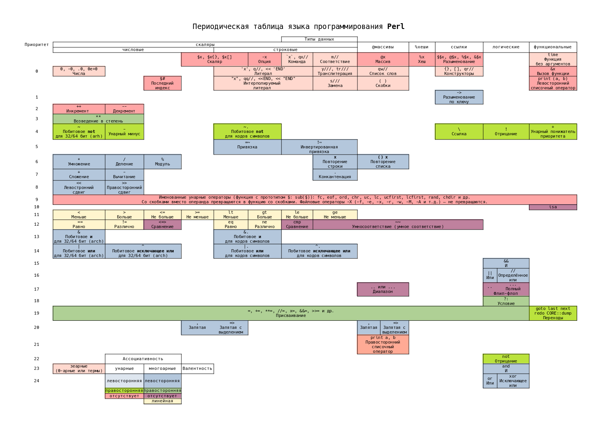

# NAME

**perl-operator-periodic-table** - Периодическая таблица операторов языка программирования Perl

# VERSION

0.0.3

# DESCRIPTION

# SYNOPSIS

Таблица использует следующие принципы:

1. Приоритет операторов отложен по вертикали.
2. По горизонтали отложены группы: типы данных с которыми работают или которые возвращают операторы.
3. Если оператор работает с несколькими типами данных, то он представлен в нескольких группах.
3. Цвет ячейки определяет валентность и ассоциативность оператора.

Линейная валентность это сцепление операторов в линию. Например: `$a <= $x < $b`, что эквивалентно `$a <= $x && $x < $b`.

Типы данных по которым сгруппированы операторы:

1. Скаляры (являются числами и строками одновременно).
2. Массивы - упорядоченная последовательность скаляров.
3. Хеши - неупорядоченная совокупность строковых ключей. Каждый ключ ссылается на скаляр или ссылку.
4. Ссылки - разыменование или, наоборот - создание ссылок.
5. Логические - конъюнция, дизъюнкция, отрицание, условие.
6. Функциональные - связаны с выполнением кода: переходы по меткам, в начало или конец блока, вызов функции или изменение приоритета операторов.

Примечания:

1. Для использования операторов `&.`, `|.`, `^.` и `~.` нужно подключить прагму `use feature bitwise;`.
2. Cсылки так же являются скалярами, причём в числовом контексте представляют собой адрес в памяти, а в строковом - тип ссылки (на что она ссылается: REF, SCALAR, GLOB, CODE, ARRAY, HASH, Regexp или класс) с адресом в памяти. Например: `ARRAY(0x5562eb3be4b8)`.
3. Пометка `(arch)` означает, что целые числа, с которыми работают операторы, зависимы от архитектуры под которой был скомпилирован **perl**: 32 или 64 бита. Хотя вполне возможно, что где-то **perl** удалось перекомпиллировать под 16 или 128-битную архитектуру, а то и экспериментальный тритный или квантовый компьютер.

# AUTHOR

Yaroslav O. Kosmina <darviarush@mail.ru>

# LICENSE

MIT