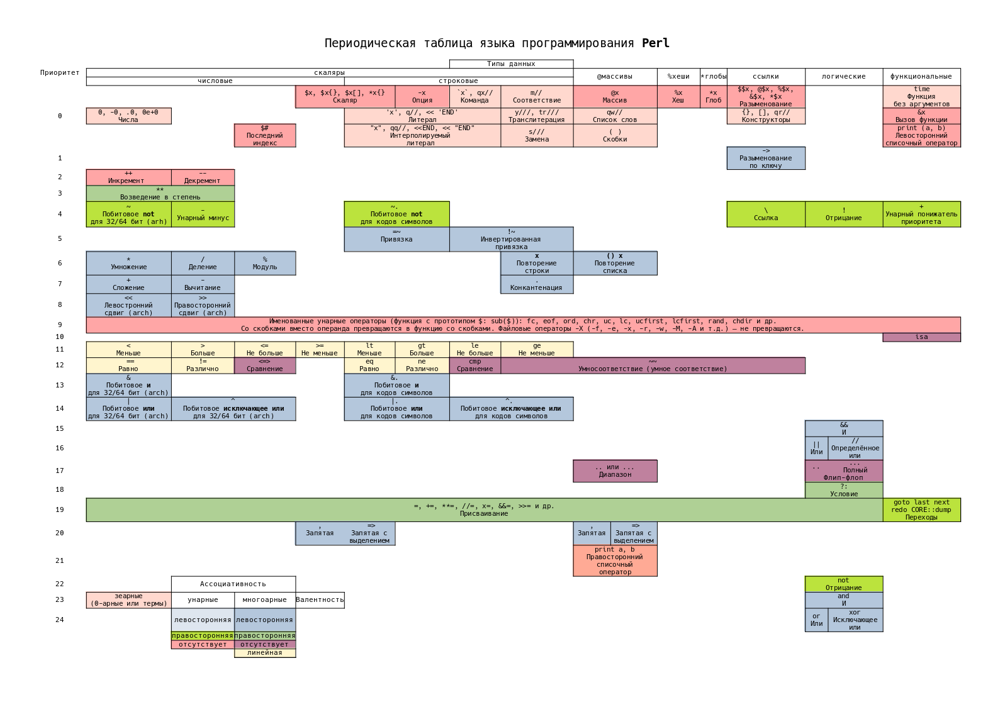

# NAME

**perl-operator-periodic-table** - Периодическая таблица операторов языка программирования Perl

# VERSION

0.0.2

# DESCRIPTION

# SYNOPSIS

Таблица использует следующие принципы:

1. Приоритет операторов отложен по вертикали.
2. По горизонтали отложены типы данных с которыми работают или которые возвращают операторы.

Так 

# AUTHOR

Yaroslav O. Kosmina <darviarush@mail.ru>

# LICENSE

MIT